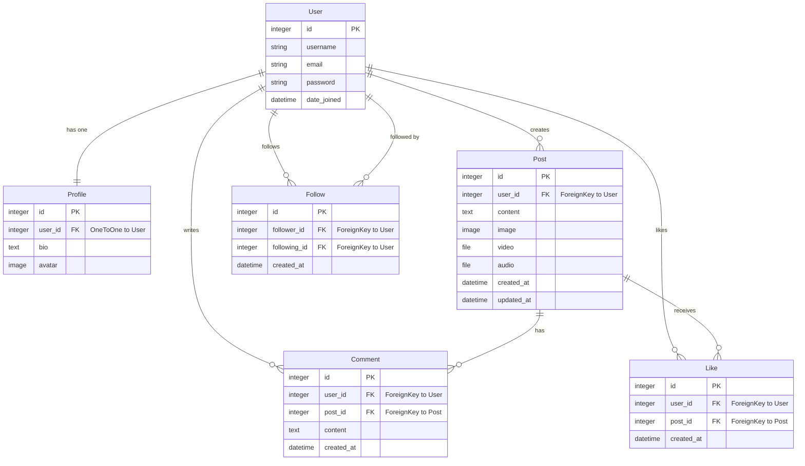

# Capstone Project - Part 2: Design Phase

## 1. Entity Relationship Diagram (ERD)

Below is the Entity Relationship Diagram for the Social Media API, representing the database structure and relationships between entities.

### Relationship Description

- **User - Profile:** One-to-One. Each user has exactly one profile.
- **User - Post:** One-to-Many. A user can create multiple posts.
- **User - Comment:** One-to-Many. A user can write multiple comments.
- **Post - Comment:** One-to-Many. A post can have multiple comments.
- **User - Like:** One-to-Many. A user can like multiple posts.
- **Post - Like:** One-to-Many. A post can receive multiple likes.
- **User - Follow:** Many-to-Many (Self-referential). A user can follow many users and be followed by many users.

---

## 2. API Endpoints

The following list defines the core API routes, their HTTP methods, and their purpose.

### Authentication & Users

| Method   | Endpoint                    | Description                                               | Auth Required |
| :------- | :-------------------------- | :-------------------------------------------------------- | :------------ |
| **POST** | `/api/register/`            | Register a new user account.                              | No            |
| **POST** | `/api/login/`               | Authenticate user and retrieve an API token.              | No            |
| **GET**  | `/api/users/`               | List all users (with pagination/search).                  | Yes           |
| **GET**  | `/api/users/{id}/`          | Retrieve detailed profile information of a specific user. | Yes           |
| **PUT**  | `/api/users/{id}/`          | Update current user's profile (bio, avatar).              | Yes (Owner)   |
| **POST** | `/api/users/{id}/follow/`   | Follow the specified user.                                | Yes           |
| **POST** | `/api/users/{id}/unfollow/` | Unfollow the specified user.                              | Yes           |

### Posts (Content)

| Method     | Endpoint           | Description                                             | Auth Required |
| :--------- | :----------------- | :------------------------------------------------------ | :------------ |
| **GET**    | `/api/posts/`      | List all posts (public timeline).                       | Yes           |
| **POST**   | `/api/posts/`      | Create a new post (supports text, image, video, audio). | Yes           |
| **GET**    | `/api/posts/{id}/` | Retrieve a specific post by ID.                         | Yes           |
| **PUT**    | `/api/posts/{id}/` | Update a post (content or media).                       | Yes (Owner)   |
| **DELETE** | `/api/posts/{id}/` | Delete a post.                                          | Yes (Owner)   |
| **GET**    | `/api/posts/feed/` | Retrieve posts from users the current user follows.     | Yes           |

### Interactions (Likes & Comments)

| Method     | Endpoint                  | Description                         | Auth Required |
| :--------- | :------------------------ | :---------------------------------- | :------------ |
| **POST**   | `/api/posts/{id}/like/`   | Like a specific post.               | Yes           |
| **POST**   | `/api/posts/{id}/unlike/` | Remove a like from a specific post. | Yes           |
| **GET**    | `/api/comments/`          | List comments (can filter by post). | Yes           |
| **POST**   | `/api/comments/`          | Add a new comment to a post.        | Yes           |
| **GET**    | `/api/comments/{id}/`     | Retrieve a specific comment.        | Yes           |
| **DELETE** | `/api/comments/{id}/`     | Delete a specific comment.          | Yes (Owner)   |
